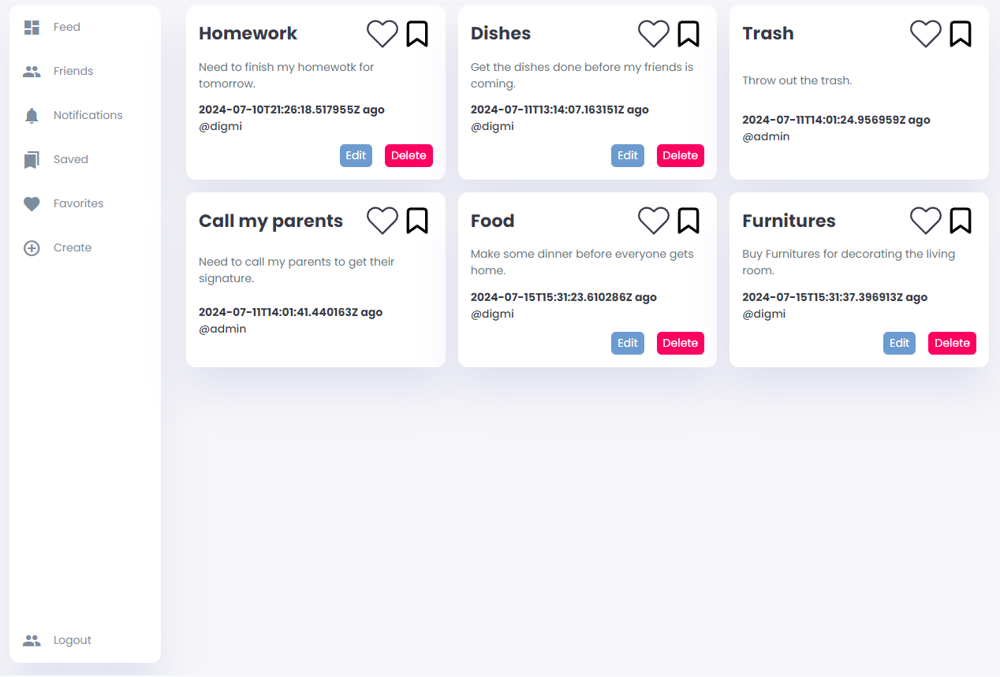
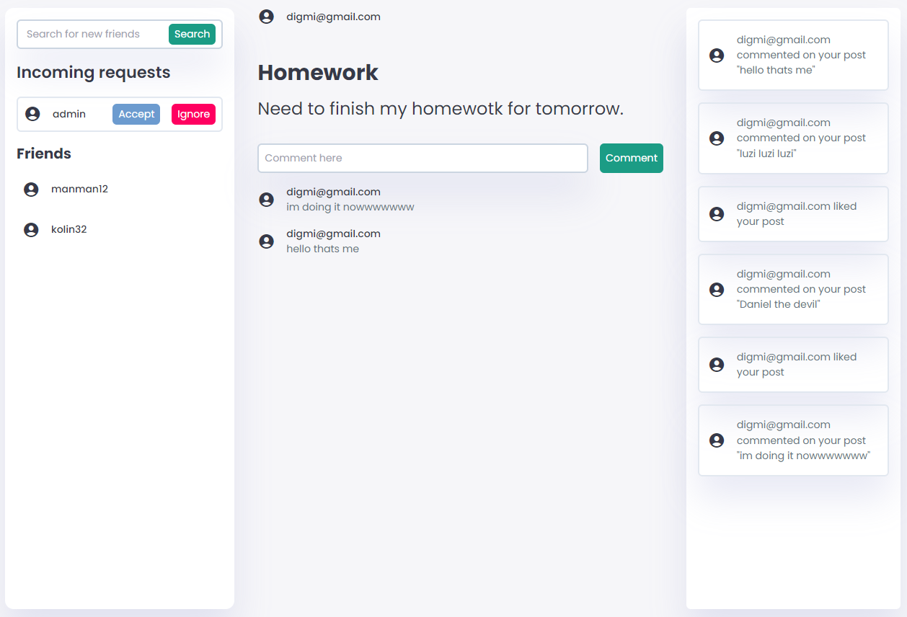
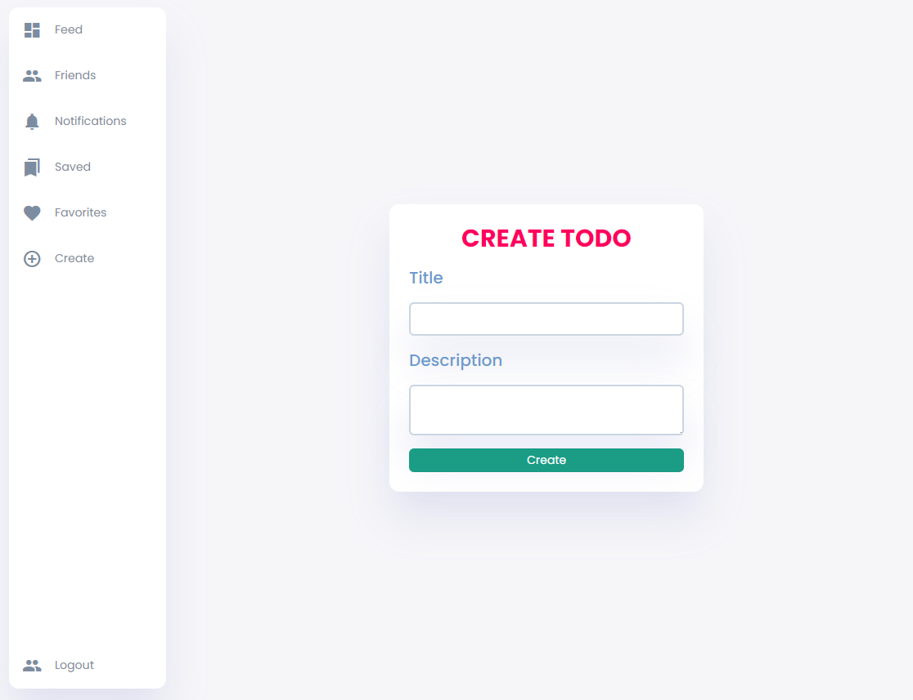

# Social Todos

### Social network app for todos.

With this app you create new todos post them and even save and like todos of other users, in each todo
there is a comment section where people can comment and discuss about the todo.

The app contains multiple pages such as home page to see all the todos, todo page that shows the information about
a single todo and a section where you can comment, and other pages such as creating todo, editing todo and auth pages.

On every page you a sidebar that can add to your layout a new component such as notification component and even a friends section
where you can see your friends list search for new friends and add them.

#### Here are some photos of the app:

##### Home page:

##### Single todo page:

On the left side you can see the friends bar where you cann see your friends search for new users and add friends.

##### Create todo page:

